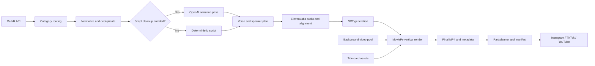

# Autopost

An end-to-end Python pipeline that turns Reddit posts into narrated, captioned vertical videos
and prepares them for controlled publishing to Instagram, TikTok, and YouTube.

[](https://github.com/daMS2005/Autopost/actions/workflows/ci.yml)
[](https://www.python.org/)

<p align="center">
  
</p>

## What it demonstrates

Autopost is more than a video-generation script. It coordinates several failure-prone systems
behind a repeatable workflow:

- content-aware Reddit ingestion for story, horror, and question/answer formats;
- deterministic text normalization and duplicate prevention;
- optional LLM-assisted narration cleanup and speaker selection;
- ElevenLabs narration with character-level alignment converted into SRT captions;
- MoviePy composition for 9:16 video, title cards, audio, and burned-in subtitles;
- duration-aware splitting with covers, captions, hashtags, and publish manifests;
- API and browser-based publishing adapters with private-by-default YouTube metadata;
- a macOS queue runner for scheduled Instagram publishing;
- isolated credentials and runtime artifacts, plus offline CI that never calls paid providers.

## Architecture



The generation and publishing stages are intentionally separate. Rendering a video does not
publish it; a platform-specific command must be invoked explicitly.

## Engineering highlights

### Content-aware generation

Subreddits map to category profiles in `content_config.py`. Each profile selects its background
pool, pacing, and duration policy. Ask-style posts use top comments rather than self-text and can
be split into speaker turns.

### One timing source for audio and captions

Narration and alignment are requested together. Character timings are converted into word timing
and then into SRT, avoiding a second transcription service and keeping captions synchronized with
the generated voice.

### Idempotent processing

`processed_posts.py` records Reddit IDs and stable content hashes in JSONL. Repeated runs skip
known content while leaving an inspectable append-only record.

### Defensive publishing

YouTube uploads default to `private`. TikTok token files are stored with owner-only permissions.
Instagram native scheduling fails closed when the scheduling UI is unavailable, rather than
silently publishing immediately. Browser sessions, tokens, outputs, and local queues are ignored
by Git.

## Tech stack

| Area | Tools |
| --- | --- |
| Language | Python 3.13 |
| Content | PRAW / Reddit API, OpenAI Responses API |
| Speech | ElevenLabs TTS with alignment |
| Video | MoviePy, FFmpeg, Pillow, PySRT |
| Publishing | YouTube Data API, TikTok Content Posting API, Playwright |
| Quality | Pytest, Ruff, GitHub Actions, Docker |

## Quick start

### Prerequisites

- Python 3.13
- FFmpeg available on `PATH`
- Reddit API credentials
- ElevenLabs API key
- OpenAI API key unless `--skip-script-cleanup` is used

### Install

```bash
git clone https://github.com/daMS2005/Autopost.git
cd Autopost
python3.13 -m venv .venv
source .venv/bin/activate
pip install -r requirements.txt
cp .env.example .env
```

Fill in the required values in `.env`, then add licensed background clips to `videos/` or to a
category directory:

```text
videos/
├── story/
├── horror/
└── ask/
```

If a category directory is empty, the pipeline falls back to the root `videos/` directory.

### Generate videos

```bash
python main.py --subreddit AITAH --limit 2
```

Multiple subreddits can be processed in one run:

```bash
python main.py --subreddit "aitah,tifu,nosleep,askreddit"
```

Useful controls:

- `--background-speed 1.1`: adjust footage speed without changing narration;
- `--chars-per-caption 22`: tune subtitle density;
- `--skip-script-cleanup`: avoid the OpenAI call and narrate deterministic normalized text;
- `--skip-v3-directions`: prevent performance cues in the cleanup pass;
- `--skip-title-card`: render without the opening card;
- `--output-dir` and `--video-dir`: override local media paths.

Run `python main.py --help` for the complete interface.

## Output contract

Each generated post produces inspectable intermediate artifacts in `output/`:

| Artifact | Purpose |
| --- | --- |
| `script_raw_*.txt` | Original source text |
| `script_vocab_*.txt` | Deterministic Reddit shorthand normalization |
| `script_cleaned_*.txt` | Optional LLM-prepared narration |
| `voice_choice_*.txt` | Selected voice and segment plan |
| `output_*.mp3` | Narration audio |
| `subtitles_*.srt` | Alignment-derived captions |
| `title_card_*.png` | Generated opening card |
| `final_video_*.mp4` | Finished 9:16 video |
| `post_metadata_*.json` | Machine-readable provenance for downstream publishing |

Generated media is intentionally excluded from version control.

## Preparing and publishing

Create duration-balanced social parts and a manifest:

```bash
python publish_cli.py prepare-video \
  --video-path output/final_video_0.mp4 \
  --output-dir output/publish/post_0
```

The manifest records part timings, covers, captions, hashtags, and source metadata. Publishing is
always a separate explicit step:

```bash
# YouTube Data API; private unless changed explicitly
python publish_cli.py youtube-upload \
  --video-path output/final_video_0.mp4 \
  --title "Story title" \
  --privacy-status private

# Browser-assisted Instagram upload
python publish_cli.py instagram-web-upload \
  --video-path output/publish/post_0/story_part_01.mp4 \
  --cover-path output/publish/post_0/story_cover_part_01.jpg \
  --caption "Caption"
```

Other commands cover TikTok OAuth/upload, YouTube Studio fallback, multi-part Instagram uploads,
weekly planning, local queue execution, and macOS LaunchAgent installation:

```bash
python publish_cli.py --help
python run_weekly_instagram.py --help
```

Browser automation may require a one-time manual login, CAPTCHA, or 2FA step. It is inherently
more fragile than an official API because platform interfaces change.

## Configuration and secrets

`.env.example` documents every supported credential and provider setting. The minimum generation
configuration is:

```dotenv
CLIENT_ID_REDDIT=...
CLIENT_SECRET_REDDIT=...
REDDIT_USER_AGENT=autopost-video-pipeline/1.0
ELEVENLABS_API_KEY=...
OPENAI_API_KEY=...
```

Publishing credentials are optional and only needed for the matching command. Never commit `.env`,
OAuth token files, browser profiles, or rendered media; the repository ignore rules cover each of
those paths.

## Development

Install the development dependencies and run the same checks as CI:

```bash
pip install -r requirements-dev.txt
ruff check .
ruff format --check .
pytest
```

The automated suite is fully offline. The paid ElevenLabs integration smoke test is deliberately
separate:

```bash
python -m scripts.manual_tts_smoke
```

That command consumes provider quota and requires explicit credentials.

### Docker

```bash
docker build -t autopost .
docker run --rm --env-file .env \
  -v "$PWD/videos:/usr/src/app/videos:ro" \
  -v "$PWD/output:/usr/src/app/output" \
  autopost --subreddit AITAH --limit 1
```

The image runs as an unprivileged user and excludes secrets, local state, and media from the build
context.

## Repository map

```text
.
├── main.py                       # generation orchestrator
├── reddit_scraper.py             # source collection and category shaping
├── script_rewriter.py            # optional narration cleanup and speaker plan
├── text_to_speech.py             # TTS, alignment, and audio assembly
├── transcriber.py                # word timing and SRT generation
├── subtitle_editor.py            # 9:16 composition and subtitle rendering
├── video_downloader.py           # background selection and usage tracking
├── video_splitter.py             # social parts, covers, and manifests
├── social_publishers.py          # official API adapters
├── web_publishers.py             # Playwright fallbacks
├── publish_cli.py                # publishing command surface
├── local_instagram_scheduler.py  # persistent local schedule queue
├── assets/                       # branded templates and OFL-licensed fonts
├── scripts/                      # explicit manual/paid smoke utilities
└── tests/                        # offline unit and integration-style tests
```

## Current limitations

- End-to-end generation depends on paid external APIs and licensed source footage, so CI validates
  deterministic logic and module integration rather than calling providers.
- Browser publishers depend on third-party page structure and may need selector maintenance.
- The sleep-resistant Instagram scheduler is macOS-specific.
- Operators remain responsible for source-content rights, platform rules, and disclosure of
  AI-generated media.

## Asset licensing

Inter and Bebas Neue are distributed under the SIL Open Font License. Their license texts are in
`assets/fonts/`. Brand artwork is project-specific and is not offered as a reusable asset pack.
